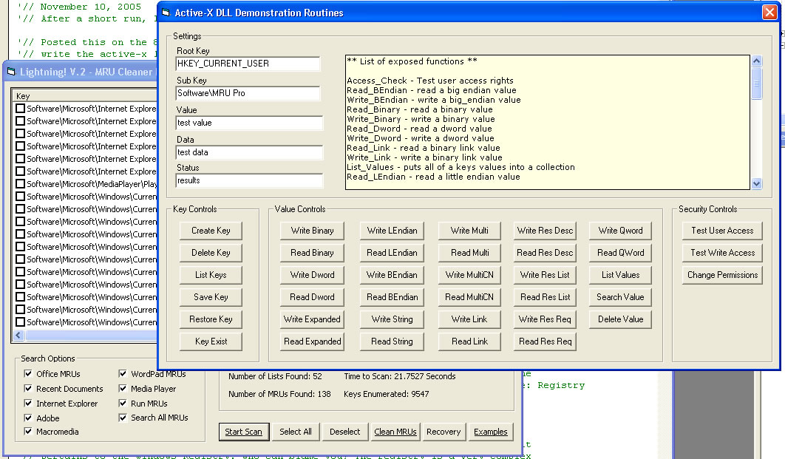



## Updated\- V6\.6 Lightning\!  Registry Class/Dll \(updated class to current version\)

### Description

A powerful active-x registry control and access wrapper class!

Every registry command imaginable has been built into this project in an easy to use wrapper. Completely rewrote active-x control and wrapper to encompass all reg read/write types. The demo project is a lightning fast MRU scanner, that requires no static lists to run, but uses predictive pattern matching to seek out MRU matches. Project also demonstrates registry security api (change key access rights), how to create a binary image of a key, and set a system restore point programmatically.

----

Added a MASSIVE series of UPDATES!! Dll functions have all been proofed, and added a sample form with all the various functions available through the class wrapper, demonstartes just how easy registry access can be with this control!

Expanded dllfunctionality, now the library encompasses every major feature of registry access, including binary key restore, and complex security api.

New Features: Dll now supports all major read/write types, including list and endian. Can now change NTFS permissions through the dll interface, ie adjust granular access permissions settings on registry objects. Added a security lookup (se-), that test users access to various security interfaces: se-kernal-debug through se-file-access.

Proofed and provided clear examples of every function..

----

Another Huge Update!!!

Added every registry value type there is, including all resource types and even rare QWORD(64bit integer), and all resource types, (driver to hardware interface). Making this the most complete registry control you will ever see!!

Expanded custom error routines, now dll passes errors through class wrapper for application handler events. Added many fixes, and proofed all reg types with clear examples of how they are used, including demonstrations of adjusting user access permissions to a key, and testing an applications installed version and path.

Check it out, leave a comment, or if you think something could be added or improved, let me know..

----

Another update! Added a number of small fixes to the code and also an example of using async multi-threading to speed up performance..

----

FINAL VERSION, V6

Included are the active-x control converted to an inline class that you can simply drop into your applications, (in prjStandalone), also a demonstration of how a commercial registry cleaner works in this example.

----

April 10, 2006 - Uploaded version of clsLightning Class I am currently using - 1.6.4

April 12, 2006

Gave the code (in the lightning class), a good once over, made some fixes, added a couple routines, fixed the error logging, and added properties/events. Added the main project to a group, and made a couple small changes.

----

April 13 2006

Made a couple little fixes and reposted..

Cheers

John
 
### More Info
 

             |
---                |---
**Submitted On**   |2006-04-13 15:11:40
**By**             |[Steppenwolfe](https://github.com/Planet-Source-Code/PSCIndex/blob/master/ByAuthor/steppenwolfe.md)
**Level**          |Intermediate
**User Rating**    |5.0 (100 globes from 20 users)
**Compatibility**  |VB 5\.0, VB 6\.0
**Category**       |[Complete Applications](https://github.com/Planet-Source-Code/PSCIndex/blob/master/ByCategory/complete-applications__1-27.md)
**World**          |[Visual Basic](https://github.com/Planet-Source-Code/PSCIndex/blob/master/ByWorld/visual-basic.md)
**Archive File**   |[Updated\-\_V1986874132006\.zip](https://github.com/Planet-Source-Code/steppenwolfe-updated-v6-6-lightning-registry-class-dll-updated-class-to-current-version__1-63220/archive/master.zip)

